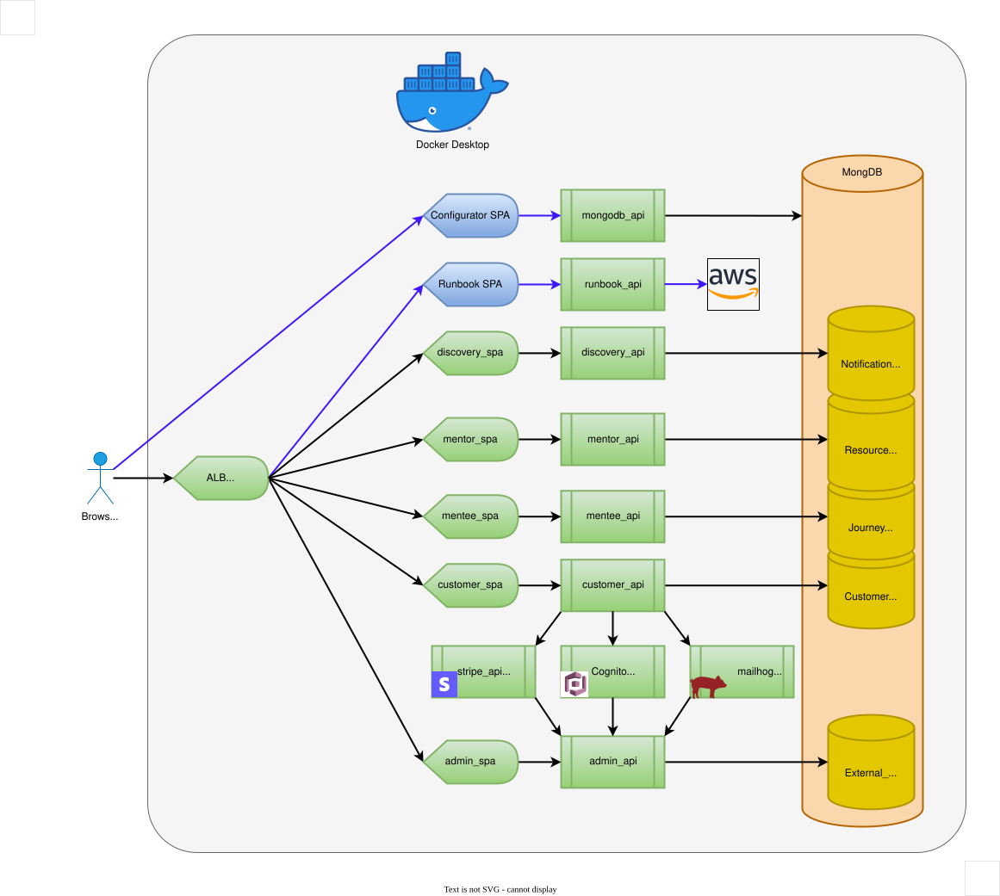

# Solution Architecture

Product and local DEV diagrams live here. AWS platform architecture, CloudFormation templates, platform config, and deployment planning live in [mentorhub_cloudformation](https://github.com/mentor-forge/mentorhub_cloudformation).

## Local Dev Environment

## drawio plugin 
    Name: Draw.io Integration
    Id: hediet.vscode-drawio
    Description: This unofficial extension integrates Draw.io into VS Code.
    Version: 1.6.6
    Publisher: hediet
    VS Marketplace Link: https://marketplace.cursorapi.com/items/?itemName=hediet.vscode-drawio