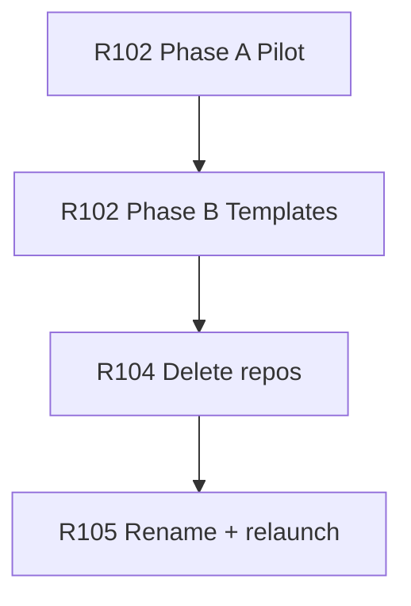

# Dev Login & Stage0 Launch Plan

**Status:** Proposed  
**Replaces:** prior `DevLoginRefactor.md` and `TEMPLATE_UPDATE.md` specifications (consolidated here + Tasks R102–R105).

This document is the **high-level map**. Executable work lives in **Tasks** — one task per phase, run in order on feature branches with PR review.

---

## Why

Developer Edition sign-in should behave like a **local IdP**: journey SPAs redirect unauthenticated users to a shared sign-in page; after login, the browser returns to the SPA with a URL-hash token that `bootstrapAuthFromUrl()` loads into `localStorage`.

Today, welcome `index.html` embeds persona links with hardcoded ports and tokens, and each SPA sends users to its own `/login` route. We are splitting welcome into a **catalog** (`index.html`) and **sign-in** (`login.html`), centralizing redirect logic in `spa_utils`, and re-launching journey repos from updated Stage0 templates after a team **architecture rename**.

The umbrella **`mentorhub` repo is not re-launched** — welcome and spec changes are edited in place.

---

## How it works (target)

```text
Developer portal (:8080/index.html)
  → plain link to Customer SPA (:8388/)
  → SPA guard → login.html?return_to=<SPA URL>
  → user picks ID + roles → Login
  → return_to#access_token=...&expires_at=...&roles=...
  → bootstrapAuthFromUrl() → app continues
```

| Asset | Role |
|-------|------|
| `index.html` | Catalog only — API explorers, repos, **plain** SPA links (no JWT) |
| `login.html` | Dev IdP — user dropdown, role checkboxes, `return_to`, client-side JWT mint |
| `spa_utils` | `buildIdpLoginRedirectUrl`, `redirectToIdpLogin` |
| Journey SPA | Guard / `401` / logout → `VITE_IDP_LOGIN_URI` (`http://127.0.0.1:8080/login.html`) |

Static nginx welcome container only — **no Flask**, no token-mint API.

**Default env:** `VITE_IDP_LOGIN_URI` / `IDP_LOGIN_URI` = `http://127.0.0.1:8080/login.html`

Full behavior (personas, security, Cypress/curl): [Reference](#reference) below.

---

## Task sequence

Run **one task at a time** per [Tasks/README.md](../Tasks/README.md). Each task is `Run as needed` but ordered by dependencies.

| Order | Task | Phase | PR focus |
|-------|------|-------|----------|
| 1 | **[R102](../Tasks/AS_NEEDED.R102.dev_login_pilot.md)** — Dev login pilot + Stage0 templates | **A:** live repos (`mentorhub`, `spa_utils`, `customer_spa`); **B:** port to Stage0 templates | `feature/dev-login-pilot` then `feature/dev-login-templates` |
| 2 | **[R104](../Tasks/AS_NEEDED.R104.stage0_delete_journey_repos.md)** — Delete journey repos | `stage0_launch` delete `spa_utils` + all journey api/spa | Ops / doc PR |
| 3 | **[R105](../Tasks/AS_NEEDED.R105.architecture_rename_and_relaunch.md)** — Rename + re-launch | Team updates `architecture.yaml`; R100; `stage0_launch` create repos | Spec PR + launch tracking |



### Supporting tasks (as needed)

| Task | When |
|------|------|
| [R101](../Tasks/AS_NEEDED.R101.welcome_personas_from_architecture.md) | Persona defaults on `login.html` if not fully covered in R102 |
| [R100](../Tasks/AS_NEEDED.R100.after_specs_update.md) | **Inside R105** — compose + `index.html` catalog after `architecture.yaml` changes |

---

## Agent / PR workflow

1. Read this plan and the **next eligible** task file in full.
2. Work on a **feature branch**; complete the task **change control checklist**.
3. Fill **Implementation notes** and **Testing results** in the task file before marking Shipped.
4. Open a **PR** for review; do not start the next task until the current one is merged (or explicitly deferred).

---

## Reference

### Personas (`login.html`)

| User | `sub` | Default roles |
|------|-------|---------------|
| Carol | `carol` | `coordinator` |
| Maria | `maria` | `mentor` |
| Cat | `cat` | `customer` |
| Mark | `mark` | `mentee` |
| Stan | `stan` | `admin` |

User dropdown resets role checkboxes to defaults; user may edit roles before Login. JWT minted client-side (`local-dev-jwt-secret-fixed`, `iss: dev-idp`, `aud: dev-api`). Hash `roles` comma-separated; must match JWT `roles` array.

### Security

- `return_to`: allowlist `http://127.0.0.1:*` and `http://localhost:*` only
- Login disabled without valid `return_to`
- Dev-only signing secret on `login.html` (banner required)

### SPA / Cypress / curl

- `bootstrapAuthFromUrl()` in `initAuth.ts` (unchanged)
- No per-SPA `/login` route — guards, `401`, and logout call `redirectToIdpLogin` only
- **Cypress:** keep `cy.login()` — do not drive `login.html` in domain specs
- **curl:** `test/e2e/e2e_auth.get_auth_token()`

### Automation IDs (`login.html`)

`welcome-login-user-id`, `welcome-login-role-coordinator` … `welcome-login-role-admin`, `welcome-login-submit`, `welcome-back-to-portal`

---

## Related

- [Tasks/README.md](../Tasks/README.md) — task execution workflow
- [SPA standards](../DeveloperEdition/standards/spa_standards.md)
- Stage0 templates: `stage0_template_vue_utils`, `stage0_template_vue_vuetify`, `stage0_template_umbrella`
