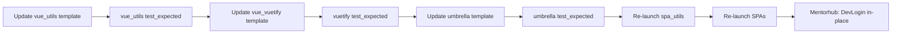

# Template update — SPA auth / IdP redirect (pre re-launch)

**Status:** Proposed  
**Do this before:** Re-launching domain `*_spa_utils` and `*_spa` repos from Stage0 templates. Umbrella welcome changes ship in the **umbrella template** for new products; **Mentor Hub** applies [DevLoginRefactor.md](./DevLoginRefactor.md) **in place** on `mentorhub` (no umbrella re-launch).  
**Templates:**

- [`stage0_template_vue_utils`](file:///Users/mikestorey/source/agile-learning-institute/stageZero/stage0_template_vue_utils)
- [`stage0_template_vue_vuetify`](file:///Users/mikestorey/source/agile-learning-institute/stageZero/stage0_template_vue_vuetify)
- [`stage0_template_umbrella`](file:///Users/mikestorey/source/agile-learning-institute/stageZero/stage0_template_umbrella) — developer portal `index.html` + dev IdP `login.html` (Part E)

**In scope per template:** SPA/utils IdP redirect (Parts A–B); umbrella static welcome split (Part E). **Mentor Hub only:** implement Part E + [DevLoginRefactor](./DevLoginRefactor.md) directly on `mentorhub` after SPA re-launch. API Explorer hash bootstrap remains optional in DevLoginRefactor.

---

## Goal

When each journey SPA and `spa_utils` repo is **re-generated or re-launched** from Stage0, it should already:

1. Call **`bootstrapAuthFromUrl()`** before the router (unchanged, keep).
2. Redirect unauthenticated users and **`401`** responses to **`VITE_IDP_LOGIN_URI`** with **`return_to`**, not to a first-class `/login` journey.
3. Keep **`/login`** only as an optional **fallback** when `VITE_IDP_LOGIN_URI` is unset (local tests, partial stacks).
4. Expose shared helpers from **`spa_utils`** so every SPA uses one implementation.

Re-launched SPAs then use `VITE_IDP_LOGIN_URI=http://127.0.0.1:8080/login.html` against the umbrella welcome container (from template Part E, or Mentor Hub in-place refactor).

---

## Execution order



| Step | Repo | Action |
|------|------|--------|
| 1 | `stage0_template_vue_utils` | Part A — auth redirect helpers + Cypress |
| 2 | `stage0_template_vue_utils` | Refresh `test_expected` |
| 3 | `stage0_template_vue_vuetify` | Part B — router, client, LoginPage, logout |
| 4 | `stage0_template_vue_vuetify` | Refresh `test_expected` |
| 5 | `stage0_template_umbrella` | Part E — `index.html` + `login.html`, compose, standards, R100/R101 |
| 6 | `stage0_template_umbrella` | Refresh `test_expected` |
| 7 | Product | Re-launch `{{slug}}_spa_utils` and each `{{slug}}_*_spa` |
| 8 | **`mentorhub` (no re-launch)** | [DevLoginRefactor.md](./DevLoginRefactor.md) on live umbrella — mirror Part E + align with re-launched SPAs |

---

## Part A — `stage0_template_vue_utils`

### A.1 Add IdP redirect utilities

**New file:** `src/utils/idpRedirect.ts`

| Export | Behavior |
|--------|----------|
| `getIdpLoginBaseUrl()` | Read `import.meta.env.VITE_IDP_LOGIN_URI`, trim trailing `/`, return `undefined` if empty |
| `buildIdpLoginRedirectUrl(baseUrl: string, returnTo?: string)` | `{baseUrl}?return_to={encodeURIComponent(returnTo ?? window.location.href)}` |
| `redirectToIdpLogin(returnTo?: string)` | If base URL present, `window.location.assign(...)`; no-op in SSR |

**Wire-up:**

- Export from `src/utils/index.ts`.
- Unit tests in `tests/utils/idpRedirect.test.ts` (mock `import.meta.env` or pass explicit `baseUrl` in pure functions).
- Update `tests/utils/index.test.ts` exports list.

### A.2 Keep URL bootstrap (no change to contract)

`src/utils/urlAuthBootstrap.ts` — keep `bootstrapAuthFromUrl`, `clearUrlSeededAuthLocalStorage`, `?clear_stored_auth=1`. Document that welcome (or any IdP) returns users with `#access_token=...` on the **SPA origin**.

### A.3 Cypress — extend, do not replace `cy.login`

**Keep** programmatic `cy.login(roles?)` for domain specs (fast, no cross-origin).

**Add** (optional Phase A.3b if timeboxed):

| Addition | Purpose |
|----------|---------|
| `cypress/config/devPersonas.ts` | Constant map: `carol` → `{ sub, roles: ['coordinator'] }`, … `stan` → `{ sub, roles: ['admin'] }` (align with [DevLoginRefactor personas](./DevLoginRefactor.md#developer-personas-and-roles)) |
| `signCypressJwt` | Accept optional `sub`; default remains `cypress-user` for generic tests |
| `cy.loginAsPersona(key)` | Calls task with persona `sub` + single role |
| `cy.loginViaHash(visitPath?, roles?)` | Visit with hash; assert hash stripped and `localStorage` set (integration with `bootstrapAuthFromUrl`) |

**Export** new modules in `package.json` `exports` if added as separate entry points (e.g. `./cypress/devPersonas`).

**Demo** (`demo/router.ts`, `PublicAuthHint.vue`): Mention IdP + `return_to`; keep public `/` entry for unauthenticated demo.

### A.4 Documentation

Update `README.md.template` and `CONTRIBUTING.md`:

- Import `buildIdpLoginRedirectUrl` / `redirectToIdpLogin` from package `utils`.
- Developer Edition: set `VITE_IDP_LOGIN_URI` to dev sign-in page (placeholder `http://127.0.0.1:8080/login.html`), not the catalog at `/`.
- Cypress: prefer `cy.login()` / `cy.loginAsPersona('stan')` for admin routes.

### A.5 `README.md.template` — replace hardcoded Control / Create examples

**Problem:** `README.md.template` (and merged `README.md` / `test_expected`) use fixed collection names from the template fixture—**Control**, **Create**, `ControlsListPage`, `CreatesListPage`, `getControls`, `useInfiniteScroll<Control>`, and links to `template_vue_vuetify`. After merge into a real product (e.g. Mentor Hub), those names are wrong.

**Goal:** All example paths, type names, and API method names in the README should render from **`Specifications/architecture.yaml`** via Jinja, using the same naming rules as `stage0_template_vue_vuetify` (`{{ item }}sListPage`, `get{{ item }}s`, etc.).

#### A.5.1 Extend `.stage0_template/process.yaml` context

Add selectors so the README can reference one **example journey domain** (template self-test uses the `sample` domain with `Control` / `Create`; merged umbrellas use their first journey domain or keep `sample` in architecture for docs):

| Context key | Purpose |
|-------------|---------|
| `example_domain` | Journey domain used for README examples—e.g. selector on `architecture.domains` where `name` is `sample`, or first domain with `data_domains.controls` (pick one rule and document it in `process.yaml` comments). |
| `example_control` | `example_domain.data_domains.controls[0]` |
| `example_create` | `example_domain.data_domains.creates[0]` |
| `example_spa_repo` | SPA repo on `example_domain` (`type: spa`, not `spa_ref`) — e.g. `sample_spa` → `{{ info.slug }}_sample_spa` after merge |

Require `example_domain.data_domains.controls[0]` (and optionally `creates[0]`) in `requires:` so merge fails fast if architecture omits them.

#### A.5.2 Replace literals in `README.md.template`

| Was (hardcoded) | Becomes (Jinja) |
|-----------------|-----------------|
| `template_vue_vuetify` repo links | `{{ org.git_org }}/{{ info.slug }}_{{ example_domain.name }}_spa` |
| `CreatesListPage` | `{{ example_create }}sListPage` |
| `ControlsListPage` | `{{ example_control }}sListPage` |
| `ControlEditPage` / `ControlNewPage` | `{{ example_control }}EditPage`, `{{ example_control }}NewPage` |
| `useInfiniteScroll<Control>` | `useInfiniteScroll<{{ example_control }}>` |
| `queryKey: ['controls']` | `['{{ example_control | lower }}s']` (match SPA list routes) |
| `api.getControls` | `api.get{{ example_control }}s` |

Apply the same pattern anywhere the README cites “real-world” SPA pages or API shapes. Fix the duplicate `{{org.git_host}}/{{org.git_host}}` segment in existing links while editing (use `{{ org.git_host }}/{{ org.git_org }}/...`).

**Note:** `useResourceList` examples can point at `{{ example_create }}sListPage`; `useInfiniteScroll` at `{{ example_control }}sListPage`—or swap if you prefer creates for infinite scroll; stay consistent with vue_vuetify template page types.

#### A.5.3 Hygiene

- [ ] Update `README.md.template` only (not hand-edit merged product READMEs).
- [ ] Re-run template test → refresh `.stage0_template/test_expected/README.md`.
- [ ] Spot-check merged `mentorhub_spa_utils` README after re-launch reads Customer/Subscription (or whatever the chosen `example_domain` provides).

### A.6 Template hygiene

- [ ] Run template build/test so `.stage0_template/test_expected/**` matches sources (per Stage0 process for vue_utils), including README from A.5.
- [ ] Bump template patch version in `package.json` / changelog note for consumers.

---

## Part B — `stage0_template_vue_vuetify`

Depends on **published or git-pinned** `spa_utils` that includes A.1. During template dev, use workspace link or git ref to utils template branch.

### B.1 Router (`src/router/index.ts`)

**Replace** unauthenticated branch:

```typescript
// Current (remove as primary path)
next({ name: 'Login', query: { redirect: to.fullPath } })
```

**With:**

```typescript
import { getIdpLoginBaseUrl, buildIdpLoginRedirectUrl } from '@{{org.git_org}}/{{info.slug}}_spa_utils/utils'

if (to.meta.requiresAuth && !isAuthenticated.value) {
  const idp = getIdpLoginBaseUrl()
  if (idp) {
    window.location.assign(buildIdpLoginRedirectUrl(idp, window.location.href))
    return
  }
  next({ name: 'Login', query: { redirect: to.fullPath } })
  return
}
```

Keep `requiresRole` / `hasStoredRole` logic unchanged (`admin` for `/admin`).

### B.2 API client (`src/api/client.template.ts`)

On **401**, after clearing `localStorage` keys:

- If `getIdpLoginBaseUrl()` → `redirectToIdpLogin(window.location.href)` (or assign with `buildIdpLoginRedirectUrl`).
- Else → existing `/login?redirect=...` (preserve pathname-only behavior or align to full `href` — **pick full `href`** for parity with guards).

Update `src/api/client.test.template.ts` expectations:

- Mock `import.meta.env.VITE_IDP_LOGIN_URI` in tests.
- Cases: IdP set → redirect URL contains `return_to`; IdP unset → `/login?redirect=...`.

### B.3 Login page (`src/pages/LoginPage.template.vue`)

**Developer Edition default:** `/login` is a **fallback**, not the primary sign-in surface.

| `VITE_IDP_LOGIN_URI` | Behavior |
|----------------------|----------|
| Set | `onMounted`: immediate `redirectToIdpLogin` with `return_to` = current SPA URL (include `route.query.redirect` when present). Show brief “Redirecting to sign-in…” (optional). Remove `target="_blank"` on IdP link. |
| Unset | Keep current card (hash hint, Continue button) for offline / unit environments. |

Update hash hint example roles: `roles=admin` (or `roles=customer`) — drop `admin,developer` template wording.

**Automation IDs:** keep `idp-login-link`, `continue-to-app-button`; add `login-redirecting` if showing interim state.

### B.4 Logout (`src/App.vue`)

**Replace** `router.push('/login')` in `handleLogout`:

```typescript
logout()
drawer.value = false
const idp = getIdpLoginBaseUrl()
if (idp) {
  redirectToIdpLogin(window.location.origin + window.location.pathname) // or href
} else {
  router.push('/login')
}
```

Optional: append `?clear_stored_auth=1` on SPA before IdP redirect if logout should clear via bootstrap (document chosen pattern; clearing in `logout()` may already empty `localStorage`).

### B.5 Unchanged files (verify present)

| File | Check |
|------|--------|
| `src/initAuth.template.ts` | Imports `bootstrapAuthFromUrl` from `{{slug}}_spa_utils` |
| `src/main.ts` | Imports `./initAuth` before `createApp` |
| `Dockerfile` | `ARG VITE_IDP_LOGIN_URI=http://127.0.0.1:8080/login.html` |
| `cypress/support/e2e.ts` | `registerAuthCommands({ visitPath: '/' })` |
| `cypress.config.ts` | `registerJwtSignTask`, `e2eDefaultJwtSecret()` |

### B.6 Cypress / README

- `README.md.template`: Document IdP redirect, `VITE_IDP_LOGIN_URI`, that E2E uses `cy.login()` not welcome UI.
- Optional: one `cypress/e2e/auth-idp.cy.template.ts` (skipped when `CYPRESS_IDP_LOGIN_URI` unset) — stub `window.location.assign` and assert `return_to` query. Ship as optional template file or document in DevLogin Phase 4 only.

### B.7 Template hygiene

- [ ] Refresh `.stage0_template/test_expected` (router, client tests, LoginPage, App.vue).
- [ ] Confirm `test_expected` `initAuth.ts` import path uses rendered org/slug placeholders.

---

## Part C — Re-launch checklist (per product)

After templates are merged and tested:

### `{{slug}}_spa_utils`

- [ ] Re-run Stage0 launch / merge from `stage0_template_vue_utils`.
- [ ] `npm run build && npm test`.
- [ ] Publish or pin version consumed by SPAs (CodeArtifact / git tag per [DEPENDENCY_MOVE.md](./DEPENDENCY_MOVE.md)).

### Each `{{slug}}_*_spa`

- [ ] Re-run Stage0 launch from `stage0_template_vue_vuetify`.
- [ ] Confirm `package.json` depends on updated `spa_utils`.
- [ ] Set `.env.development` / compose: `VITE_IDP_LOGIN_URI=http://127.0.0.1:8080/login.html`.
- [ ] `npm run build`, `npm test`, `npm run cypress:run`.
- [ ] Smoke: unauthenticated SPA `/` → `login.html?return_to=...` (catalog at `:8080/` has no tokens).

### Mentor Hub (mentor-forge)

- [ ] **Do not** re-launch the umbrella `mentorhub` repo from Stage0.
- [ ] Re-launch `mentorhub_spa_utils`, `mentorhub_*_spa` from Parts A–B (or port template diffs).
- [ ] Apply [DevLoginRefactor.md](./DevLoginRefactor.md) **in place** on `mentorhub` — same outcome as Part E (split `index.html` / `login.html`, compose `IDP_LOGIN_URI`, personas). Use Part E as the checklist when editing live files.

### New products (future umbrella merge)

- [ ] Merged umbrella from updated `stage0_template_umbrella` already includes Part E; set SPA `VITE_IDP_LOGIN_URI` to `http://127.0.0.1:8080/login.html` at merge/R100.

---

## Part E — `stage0_template_umbrella`

Delivers the static nginx **welcome container** pattern from [DevLoginRefactor.md](./DevLoginRefactor.md#two-page-welcome-static-nginx). **No Flask**, no new API service—two HTML assets in the existing welcome image.

### E.1 Split welcome assets

| File | URL | Responsibility |
|------|-----|----------------|
| **`index.html`** | `/` | **Developer portal** — service catalog only (R100 layout: SPA/API rows, ports from `architecture.yaml`, plain SPA `href`s without JWT hash). Optional link: “Sign in” → `/login.html`. **Remove** `.welcome-auth`, Genny/Adam, `setPersonaLink`, `TOKEN_*`, `spaAuthHash` from index. |
| **`login.html`** | `/login.html` | **Dev IdP** — `return_to` query, user ID dropdown, five role checkboxes (defaults on user change; user may edit roles), **Login** mints JWT and redirects with hash. |
| **`welcome-auth.js`** (recommended) | loaded by `login.html` only | `PERSONAS`, `ALL_ROLES`, `validateReturnTo`, `signDevJwt`, `spaAuthHash`, `onLogin` — keeps HTML small. |

**UX detail (normative):** See [Developer personas and roles](./DevLoginRefactor.md#developer-personas-and-roles) in DevLoginRefactor — Carol/Maria/Cat/Mark/Stan defaults; client-side HS256 with `local-dev-jwt-secret-fixed` on Login (dev-only banner).

### E.2 `Dockerfile`

```dockerfile
COPY index.html /usr/share/nginx/html/index.html
COPY login.html /usr/share/nginx/html/login.html
# optional: COPY welcome-auth.js /usr/share/nginx/html/welcome-auth.js
```

Keep `nginx:stable-alpine`; no CMD change.

### E.3 `DeveloperEdition/docker-compose.yaml` (template)

- **`welcome` service** — unchanged role (port `8080`, all profiles).
- **Each journey SPA** — set `IDP_LOGIN_URI` / document build arg default:

  ```yaml
  IDP_LOGIN_URI: ${IDP_LOGIN_URI:-http://127.0.0.1:8080/login.html}
  ```

- **Not** `http://127.0.0.1:8080/` — sign-in lives on `login.html`.

### E.4 Tasks and merge docs

| Task / doc | Update |
|------------|--------|
| **`Tasks/AS_NEEDED.R100.after_specs_update.md`** | `index.html` = catalog links only (plain SPA URLs). `IDP_LOGIN_URI` → `/login.html`. Remove “Genny/Adam persona links at merge” from index; point to R101 for `login.html`. |
| **`Tasks/AS_NEEDED.R101.welcome_personas_from_architecture.md`** | Target **`login.html`** / `welcome-auth.js` (not index). Align with DevLoginRefactor persona table. |
| **`DeveloperEdition/standards/spa_standards.md`** | `VITE_IDP_LOGIN_URI` example: `http://127.0.0.1:8080/login.html`. |
| **`DeveloperEdition/standards/sre_standards.md`** | IdP redirect and `IDP_LOGIN_URI` examples use `/login.html`; catalog at `/` does not issue tokens. |
| **`DeveloperEdition/standards/api_standards.md`** | Welcome issues hash via `login.html` callback to `return_to` SPA origin. |
| **`CONTRIBUTING.md`** | Welcome container serves portal + sign-in page. |

### E.5 `index.html` template (Jinja) — catalog script

- Keep hostname-based port wiring for API explorers and **plain** SPA links: `http://${hostname}:{{ spa_port }}/` (no hash, no `setPersonaLink`).
- Loop journey domains from architecture (existing R100 patterns).
- Remove legacy persona block entirely from template source.

### E.6 `login.html` template (new)

- Static structure + Jinja for `{{ info.name }}` in title/header.
- `PERSONAS` may be inlined or injected at build; default five users/roles per DevLoginRefactor.
- `data-automation-id`: `welcome-login-user-id`, `welcome-login-role-*`, `welcome-login-submit`, `welcome-back-to-portal`.
- Dev-only warning: local JWT signing; secret matches `mh` / compose `JWT_SECRET` default.

### E.7 `.stage0_template/process.yaml`

- Add output path: `./login.html` (and `./welcome-auth.js` if used).
- Keep `./index.html` in process file list.

### E.8 Template hygiene

- [ ] Refresh `.stage0_template/test_expected/` (`index.html`, `login.html`, `Dockerfile`, `docker-compose.yaml`, standards, R100/R101).
- [ ] Run umbrella template self-test per Stage0 harness.
- [ ] Verify merged test product opens portal at `/`, SPA → `login.html?return_to=...` once SPAs use Part B.

### E.9 Mentor Hub vs template

| | `stage0_template_umbrella` | `mentorhub` (live) |
|--|---------------------------|-------------------|
| Re-launch? | Yes — for **new** umbrella merges | **No** — edit files directly |
| Work | Part E in template | [DevLoginRefactor](./DevLoginRefactor.md) implementing same split |
| Reference | Template is source of truth going forward | Port diffs from template after E is merged |

---

## Part D — Adjust DevLoginRefactor after re-launch

Once templates and re-launched SPAs include Part A/B:

| DevLoginRefactor section | Change |
|--------------------------|--------|
| **SPA changes** | Done via template A/B + SPA re-launch |
| **Welcome / portal** | Implement on **`mentorhub` in place** — follow Part E checklist (not umbrella re-launch) |
| **Phase 1** | Drop duplicate SPA tasks; umbrella = split HTML + compose `IDP_LOGIN_URI` |
| **Cypress** | `loginAsPersona` in `mentorhub_spa_utils` if not in template A.3 |
| **Personas** | `login.html` on mentorhub + R101; template E ships defaults for new products |

---

## Acceptance criteria

- [ ] Utils template exports `buildIdpLoginRedirectUrl` / `redirectToIdpLogin` with tests.
- [ ] Vuetify template router + client use IdP when `VITE_IDP_LOGIN_URI` is set.
- [ ] LoginPage auto-redirects to IdP when configured; manual flow when not.
- [ ] Logout sends user to IdP (or `/login` fallback).
- [ ] `bootstrapAuthFromUrl` still runs in `initAuth` before router.
- [ ] Cypress `cy.login()` still passes in template `test_expected`.
- [ ] Re-launched Mentor Hub SPAs behave as above without hand-editing each repo’s router/client.
- [ ] Umbrella template provides `index.html` (catalog) + `login.html` (IdP); `IDP_LOGIN_URI` defaults to `/login.html`.
- [ ] Mentor Hub in-place refactor matches Part E without re-launching umbrella.
- [ ] `spa_utils` `README.md.template` uses architecture-driven example domain/collection names (no hardcoded Control/Create).

---

## File change summary

### `stage0_template_vue_utils`

| Action | Path |
|--------|------|
| Add | `src/utils/idpRedirect.ts` |
| Add | `tests/utils/idpRedirect.test.ts` |
| Edit | `src/utils/index.ts` |
| Edit | `tests/utils/index.test.ts` |
| Optional | `cypress/config/devPersonas.ts`, `registerAuthCommands.ts`, `cypress/tasks/signCypressJwt.ts` |
| Edit | `README.md.template` (A.5 domain variables; A.4 IdP docs), `CONTRIBUTING.md` |
| Edit | `.stage0_template/process.yaml` — `example_domain`, `example_control`, `example_create` context |
| Sync | `.stage0_template/test_expected/**` |

### `stage0_template_vue_vuetify`

| Action | Path |
|--------|------|
| Edit | `src/router/index.ts` |
| Edit | `src/api/client.template.ts`, `src/api/client.test.template.ts` |
| Edit | `src/pages/LoginPage.template.vue` |
| Edit | `src/App.vue` |
| Edit | `README.md.template` |
| Optional | `cypress/e2e/auth-idp.cy.template.ts` |
| Sync | `.stage0_template/test_expected/**` |

### `stage0_template_umbrella`

| Action | Path |
|--------|------|
| Edit | `index.html` — catalog only; remove persona / `setPersonaLink` |
| Add | `login.html` — user dropdown, role checkboxes, Login + `return_to` |
| Add | `welcome-auth.js` (optional) |
| Edit | `Dockerfile` — COPY `login.html` (+ JS) |
| Edit | `DeveloperEdition/docker-compose.yaml` — `IDP_LOGIN_URI` → `/login.html` |
| Edit | `Tasks/AS_NEEDED.R100.after_specs_update.md`, `Tasks/AS_NEEDED.R101.welcome_personas_from_architecture.md` |
| Edit | `DeveloperEdition/standards/spa_standards.md`, `sre_standards.md`, `api_standards.md` |
| Edit | `.stage0_template/process.yaml` |
| Sync | `.stage0_template/test_expected/**` |

---

## References

- [DevLoginRefactor.md](./DevLoginRefactor.md) — `login.html` UX, personas, link-back (Mentor Hub implementation guide)
- [`stage0_template_umbrella`](file:///Users/mikestorey/source/agile-learning-institute/stageZero/stage0_template_umbrella) — Part E target template
- [SPA standards](../DeveloperEdition/standards/spa_standards.md) — `bootstrapAuthFromUrl`, `VITE_IDP_LOGIN_URI`
- Live reference: `mentorhub` (umbrella, in-place), `mentorhub_spa_utils`, `mentorhub_*_spa` (re-launch from vue templates)
